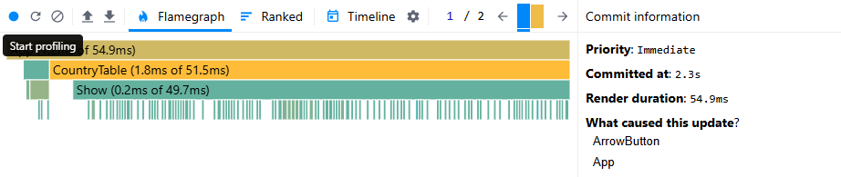
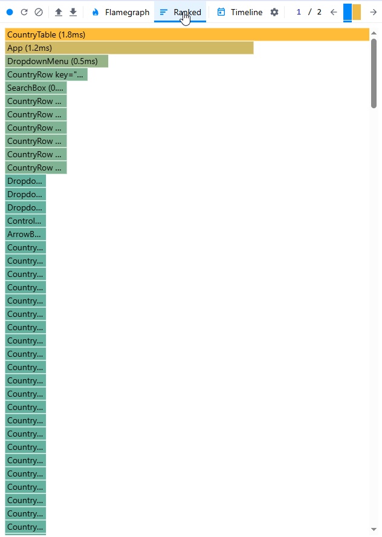
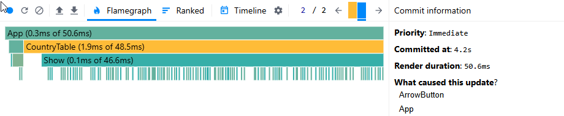
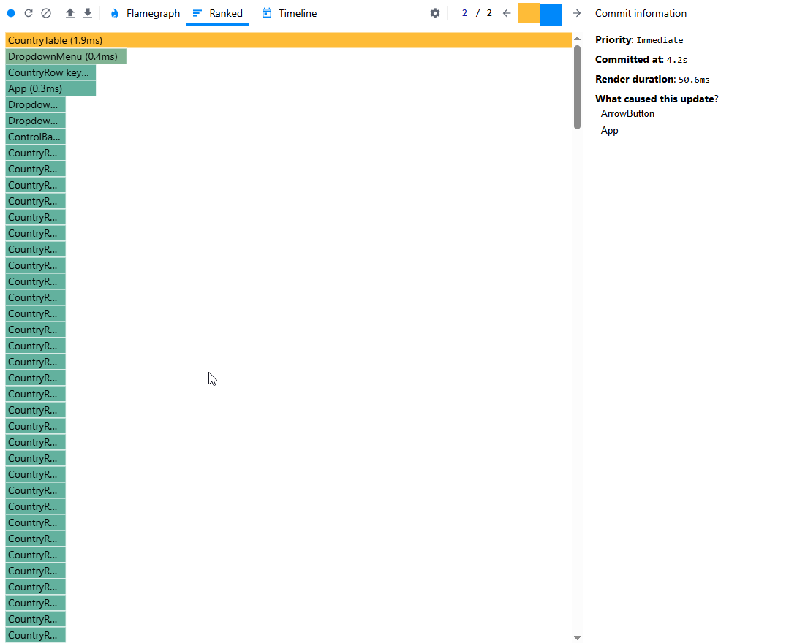

# Performance Profiling Task

## Initial Profiling with React Dev Tools Profiler

### Steps Taken:

1. Used React Dev Tools Profiler to measure performance.
2. Recorded interactions such as sorting a column.
3. Analyzed the results including commit duration, render duration, interactions, flame graph, and ranked chart.

### Initial Performance Results:

- **Commit Duration:** _[insert result]_
- **Render Duration:** _[insert result]_
- **Interactions:** _[insert result]_
- **Flame Graph Analysis:**
  
- **Ranked Chart Analysis:**
  

## Optimization with React.memo and useMemo

### Optimizations Applied:

- Used `React.memo` to prevent unnecessary re-renders.
- Used `useMemo` to memoize computed values.

### Updated Profiling Results:

- **Commit Duration:** _[insert result]_
- **Render Duration:** _[insert result]_
- **Interactions:** _[insert result]_
- **Flame Graph Analysis:**
  
- **Ranked Chart Analysis:**
  

## Comparison Before & After Optimization

| Type of interaction | Metric          | Before Optimization | After Optimization | Improvement (%) |
| ------------------- | --------------- | ------------------- | ------------------ | --------------- |
|                     | Commit Duration | 2.3 ms              | _[insert]_         | _[insert]_      |
| Sort by name        | Render Duration | 54.9 ms             | _[insert]_         | _[insert]_      |
|                     | Renders         | 216                 | _[insert]_         | _[insert]_      |
|                     |                 |                     |                    |                 |
|                     | Commit Duration | 4.2 ms              | _[insert]_         | _[insert]_      |
| Sort by population  | Render Duration | 50.6 ms             | _[insert]_         | _[insert]_      |
|                     | Renders         | 207                 | _[insert]_         | _[insert]_      |

### Observations:

- Reduced commit and render durations.
- Decreased the number of unnecessary renders.
- Improved sorting performance.

## Conclusion

Applying `React.memo` and `useMemo` significantly optimized rendering performance. Future improvements could involve analyzing dependencies and fine-tuning state management.

---

**Screenshots & performance analysis should be added in place of placeholders.**

# Performance Profiling Report

## 1. Initial Profiling (Before Optimization)

### Commit Duration

- Sorting by name: **X ms**
- Sorting by population: **Y ms**

### Render Duration

- CountryRow: **Z ms**
- CountryTable: **W ms**

### Ranked Chart (Before Optimization)

---

## 2. Optimized Profiling (After Optimization)

### Commit Duration (Improved)

- Sorting by name: **A ms** (↓ B% improvement)
- Sorting by population: **C ms** (↓ D% improvement)

### Render Duration

- CountryRow: **E ms** (↓ F%)
- CountryTable: **G ms** (↓ H%)

### Ranked Chart (After Optimization)

---

## 3. Summary

- **Reduced render duration by X%**.
- **Lower commit duration by Y%**.
- **Fewer unnecessary re-renders** thanks to `React.memo`, `useMemo`, `useCallback`.

## Before optimization:

### Sort by name

Flame Graph

Ranked Chart:

### Sort by population

Flame Graph

Ranked Chart:

