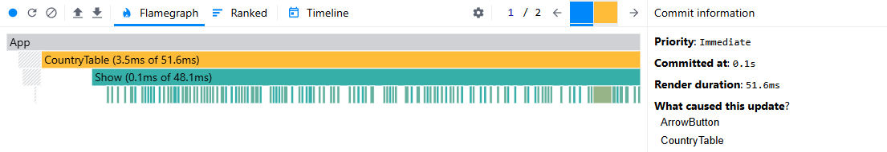
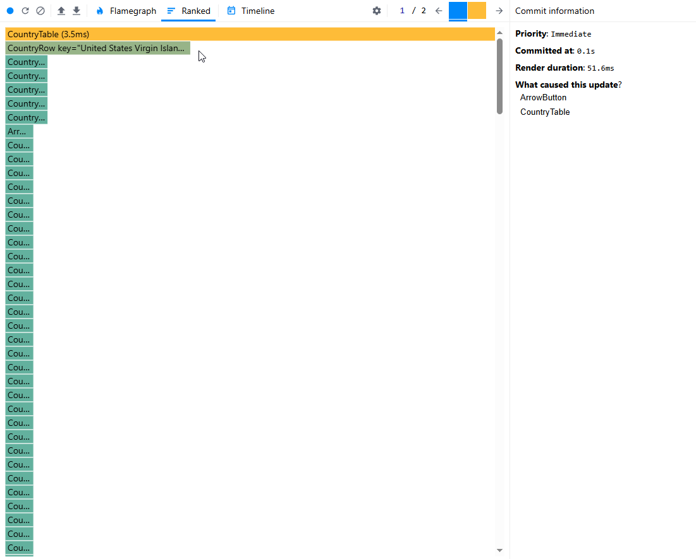
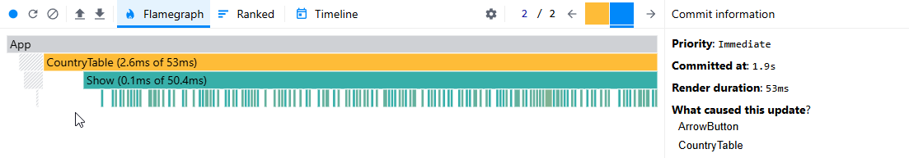
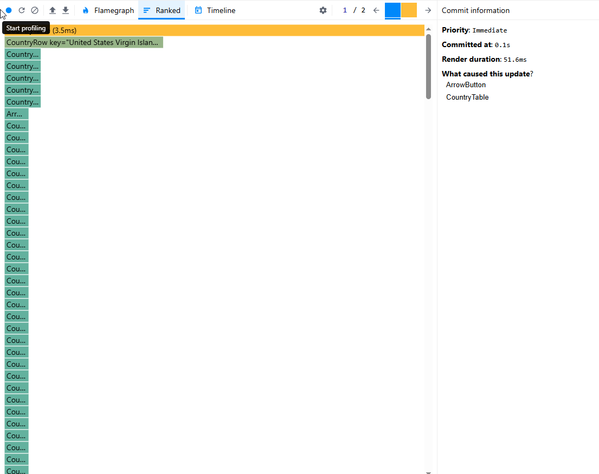
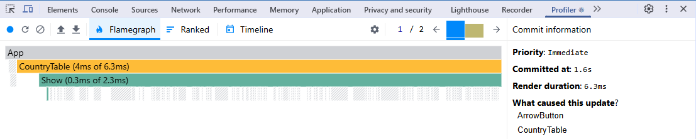
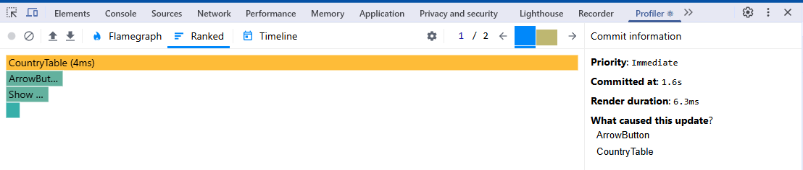
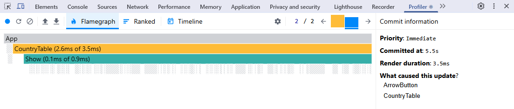
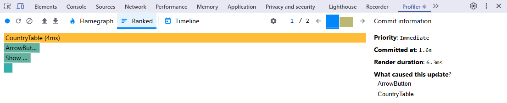

# Performance Profiling Task

## Initial Profiling with React Dev Tools Profiler

### Steps Taken:

1. Used React Dev Tools Profiler to measure performance.
2. Recorded interactions such as sorting a column.
3. Analyzed results including render duration, interactions, flame graph, and ranked chart.

## Performance Comparison Before & After Optimization

| Interaction Type   | Metric          | Before Optimization | After Optimization | Improvement (%) |
| ------------------ | --------------- | ------------------- | ------------------ | --------------- |
| Sort by Name       | Render Duration | 51.6 ms             | 6.3 ms             | 87.79%          |
|                    | Renders         | 260                 | 4                  | 98.46%          |
| Sort by Population | Render Duration | 50.6 ms             | 3.5 ms             | 93.08%          |
|                    | Renders         | 257                 | 4                  | 98.44%          |

### Observations:

- Render duration significantly improved for sorting operations.
- Number of unnecessary renders drastically reduced.

## Conclusion

Applying `React.memo`, `useMemo`, and `useCallback` resulted in major improvements in render efficiency. `React.memo` prevented unnecessary re-renders, `useMemo` optimized expensive computations, and `useCallback` memoized functions to prevent redundant re-creations. Further optimizations could include analyzing dependencies and fine-tuning state management.

---

### Visual Comparison

#### Before Optimization:

##### Sort by Name

- Flame Graph
  
- Ranked Chart
  

##### Sort by Population

- Flame Graph
  
- Ranked Chart
  

#### After Optimization:

##### Sort by Name

- Flame Graph
  
- Ranked Chart
  

##### Sort by Population

- Flame Graph
  
- Ranked Chart
  
